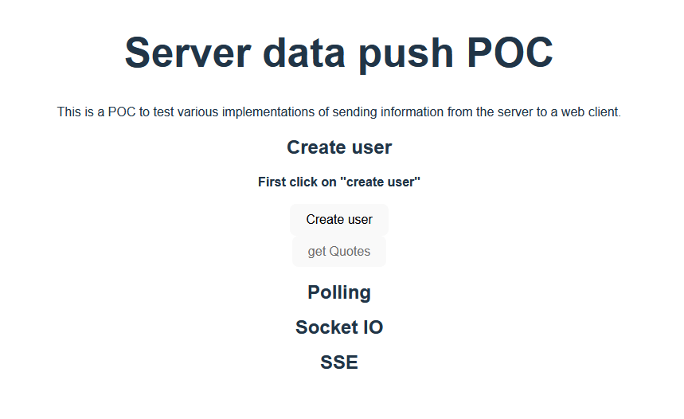

# SERVER TO CLIENT COMMUNICATION

POC built to try different technologies/implementations of server to client communication. Find here implemented:
1. Short polling
2. [SocketIO](https://socket.io/)
3. [Server sent events (SSE)](https://developer.mozilla.org/en-US/docs/Web/API/Server-sent_events/Using_server-sent_events)

## API

Built using express. It is composed of the following components:
1. Short polling controller
2. SSE controller
3. User controller
4. Quote controller
5. A SocketIO server

## CLIENT

Built using Vite and Vue. It is a single web application that will fire requests and listen to a Socket IO server hosted in the API.

## HOW TO RUN LOCALLY

1. Run `npm i`
1. Run the API with the command `npm run api:dev`
2. Run the client with the command `npm run client:dev`

## USE CASE IMPLEMENTED

The POC also illustrates a usecase in where implementing a Websockets based solution like SocketIO would make the response time of the system faster. Lets say we have a polling cycle of 5s which cant be lowered because it would generate performance problems in the API. Then in case of having a processing time for a recently created user of 6s during which the quote cant be retrieved, a solution based in 5s cycles would make the user wait for 10s in order to retrieve a quote. In this case, a solution based in Websockets would allow the system to notify the client as soon as the user is ready, which would be 6s, instead of 10s. To see this usecase, simply launch or restart the POC, click in the "create user" button, and then inmediatly click on the "get quotes" button